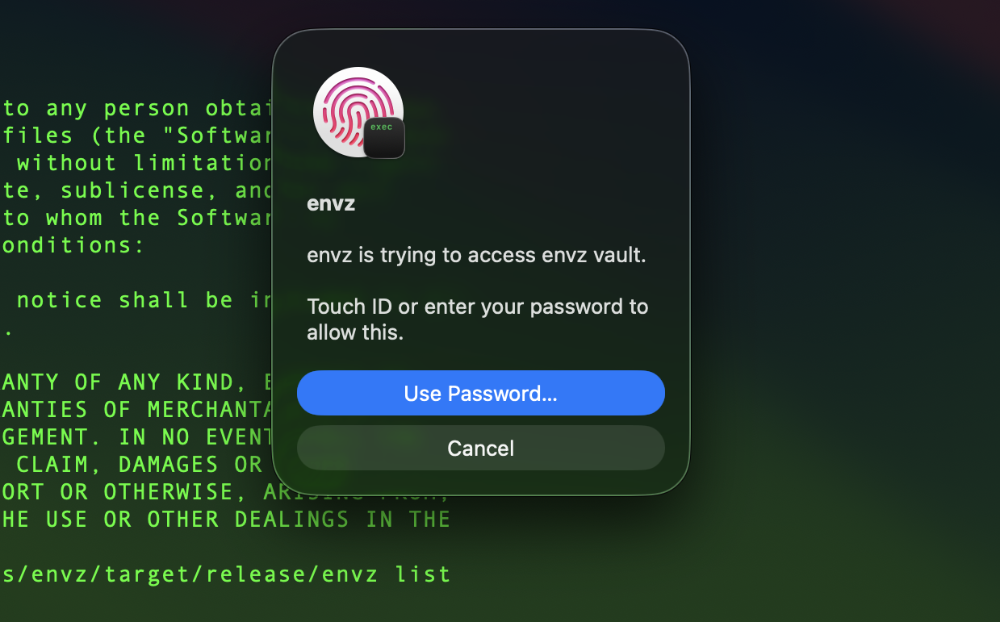

# envz

Secure environment variable management for macOS. Encrypts secrets at rest using AES-256-GCM and stores decryption keys in your macOS Keychain with Touch ID authentication.

## Why envz?

In the age of AI agents and LLMs, your environment variables are more exposed than ever. Coding assistants, shell agents, and dev tools routinely have access to your terminal session — and with it, every secret sitting in a plaintext `.env` file. One careless API call from an agent and your keys are sent to a third party.

**envz** was built to fix this. Secrets are encrypted at rest, decrypted in-memory only when needed, and never exposed to processes that don't need them. The `unsafe` command lets you run untrusted tools (like LLM agents) in a sanitized environment where your secrets simply don't exist.

- **AES-256-GCM encryption** — secrets never stored as plaintext
- **OS Keychain storage** — decryption keys live in macOS Keychain
- **Touch ID required** — biometric authentication on every vault access
- **Process isolation** — inject secrets only into the processes that need them
- **Safe mode** — run untrusted commands (LLM agents, scripts) with filtered environment variables



> **Platform:** macOS only (requires Keychain and Touch ID)

## Installation

### Homebrew

```bash
brew install hortopan/tap/envz
```

### From releases

Download the latest binary from [GitHub Releases](https://github.com/hortopan/envz/releases).

### From source

```bash
cargo install --path .
```

### With code signing (for Keychain access)

```bash
./scripts/build_macos.sh
sudo cp target/release/envz /usr/local/bin/
```

## Quick start

```bash
# Initialize a new vault in the current directory
envz init

# Import from an existing .env file
envz init .env

# Add secrets
envz set DATABASE_URL="postgres://localhost/mydb"
envz set API_KEY="sk-secret-key"

# View secrets
envz list
envz get DATABASE_URL

# Run a command with secrets injected
envz run -- npm start
envz run -- docker compose up

# Load into current shell
source <(envz env)

# Unload from current shell
source <(envz unenv)
```

## Commands

| Command | Description |
|---|---|
| `envz init [file]` | Initialize a new vault, optionally importing from a `.env` file |
| `envz set KEY=VALUE` | Set an environment variable |
| `envz get KEY` | Get the value of a variable |
| `envz delete KEY` | Delete a variable |
| `envz list` | List all variables and values |
| `envz clear` | Remove all variables from the vault |
| `envz run -- <cmd>` | Run a command with vault variables injected |
| `envz env` | Output `export` statements for shell sourcing |
| `envz unenv` | Output `unset` statements to remove variables |
| `envz unsafe -- <cmd>` | Run a command with only safe system environment variables |

### Global options

| Option | Description |
|---|---|
| `-v`, `--vault <path>` | Path to the vault file (default: `.envz` in current directory) |
| `--force` | Overwrite existing vault during `init` |

By default, envz reads and writes a `.envz` file in the current directory. Use `--vault` to point at a different file:

```bash
# Use a vault in a specific location
envz --vault ~/secrets/project.envz init
envz -v ~/secrets/project.envz set API_KEY="sk-secret-key"
envz -v ~/secrets/project.envz run -- npm start

# Or set it via environment variable
export ENVZ_VAULT=~/secrets/project.envz
envz list
```

## Security model

> **Important:** envz is a convenience tool for local development, not a vault for production secrets. It raises the bar compared to plaintext `.env` files, but it is not — and does not try to be — a hardened secrets manager. Your production secrets should live in a proper secrets manager (AWS Secrets Manager, HashiCorp Vault, 1Password, etc.), be scoped with least-privilege IAM policies, and rotated regularly. If a key leaks, **revoke and rotate it** — no amount of local encryption changes that.

What envz *does* give you:

- **AES-256-GCM encryption** at rest — secrets aren't sitting in plaintext on disk
- **macOS Keychain + Touch ID** — the decryption seed requires biometric auth, so a stolen `.envz` file alone is useless
- **Code-signature binding** — the encryption key is derived from the binary's signing identity, so a different (or unsigned) binary can't decrypt
- **Build-time app secret** — an additional secret baked into the binary (encrypted via litcrypt, not visible with `strings`) is mixed into key derivation
- **Process isolation** — secrets are injected only into processes that need them, and the `unsafe` command strips them entirely
- **Zeroized memory** — sensitive buffers are wiped after use

What envz *doesn't* protect against:

- A compromised machine with root access
- Memory inspection of a running process
- An attacker who has both the binary and access to your Keychain
- Keys that have already been leaked — **rotate them**

The goal is simple: make it harder for secrets to accidentally end up in logs, agent contexts, shell history, or git commits during day-to-day development.

### The `unsafe` command

The `unsafe` command runs a process with a minimal, curated set of environment variables (PATH, HOME, SHELL, TERM, etc.), stripping out anything that could leak secrets. This is useful for running LLM agents or untrusted scripts safely.

## How it works

```
┌──────────────┐     ┌──────────────┐     ┌──────────────┐
│  .envz file  │────>│  AES-256-GCM │────>│  Plaintext   │
│  (encrypted) │     │  decryption  │     │  (in-memory) │
└──────────────┘     └──────┬───────┘     └──────────────┘
                            │
                     ┌──────┴───────┐
                     │ macOS        │
                     │ Keychain     │
                     │ (master key) │
                     └──────────────┘
```

## License

[MIT](LICENSE) — Alex Hortopan
